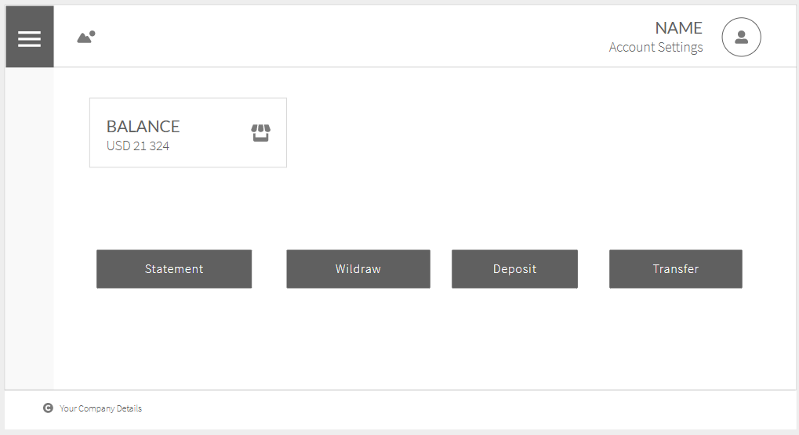

# Banking Application!

The proposed solution presented here aims to meet the basic requirements involving financial transactions, such as selecting an account, viewing details such as balance and statement, and making transfers.

# Solution Architecture

To meet high availability and performance requirements, Azure Front Door allows you to create geographic routing policies in addition to offering options for monitoring.
The idea is to make use of two AKS clusters in to provision both the APIs and the SPA application and its micro front-ends. With API Managment will be created traffic policies and caching in Redis enabling an even more scalable experience.
For databases, the strategy is a combination of relational databases for each micro service, maintaining the integrity of the operation data, for reading databases and even for the Event Store, the use would be with CosmosDB each in the same region where the micro services are hosted.


# User Experience

The application aims to provide quick access to features.

 1. Main Page



 2. Deposit


 3. Withdraw


 
 4. Transfer


 
 5. Statement


# Front-End Macro Architecture

The front-end solution should be divided into a micro front-end orchestrator and the micro front-ends that will compose the SPA application.

 1. Orchestrator
 - verticalComponent: spot for menu
 - horizontalComponent: spot for breadcrumb and header
 - mainComponent: spot for render micro front-ends

 2. Menu (Micro Front-end)
 - itemComponent
 - listItemsComponent

 3. Main (Micro Front-end)
 - balanceComponent

 4. Statement (Micro Front-end)
 - itemComponent
 - listItemsComponent
 - filterComponent

 5. Deposit (Micro Front-end)
 - qrCodeComponent
 - dataComponent

 6. Withdraw (Micro Front-end)
 - qrCodeComponent
 - dataComponent
 - cameraComponent
 - amountComponent

 7. Tranfer (Micro Front-end)
 - balanceComponent
 - fromComponent (must include balanceComponent)
 - toComponent
 - confirmationComponent

# Back-End Architecture
In the backend 5 domains will compose the ecosystem of APIs and a 6th one will work as an anti-corruption layer meeting only the demands to load the Query Stack.


 1. Person:
 Onboarding process, KYC, segmentation.

 2. Account:
 Account management, one customer may have many account in this scenario

 3. Transation:
 Responsible for the SAGA process of the transfer an asset to another account. 

 In this SAGA is necessary check the balance of the source account, check how to exchange source currency to the destination currency, compute fee, the liquidit necessary to make this exchange.


Another point is the date of the transaction, all date are stores in timestamp type on UTC, but displayed based on the location of the user.

 4. Currency Exchange:
 Responsible for the flow, tax, rate, liquidity account and rules to convert a currency in another currency.

 5. Reconciliation:
 Responsible for compute the balance and limits for each account based on the transactions.

# HTTP route strategy

 1. Get Customer Data:
```http
GET: /customer/{hashencoded}
```

 2. Get Customer Accounts:
```http
GET: /customer/{hashencoded}/account
```

 3. Get Customer Account Data:
```http
GET: /customer/{hashencoded}/account/{hashencoded}
```

 4. Get Customer Account Statement:
```http
GET: /customer/{hashencoded}/account/{hashencoded}/statement
```

 5. Get Customer Account Deposit Data:
```http
GET: /customer/{hashencoded}/account/{hashencoded}/Deposit
```

 6. Get Initial Transfer Data:
```http
GET: /customer/{hashencoded}/account/{hashencoded}/transfer
```
response:
```json
    {
        "balances": [
            {
                "currency": "USD", "amount": 100.00
            },
            {
                "currency": "CAD", "amount": 100.00
            }
        ]
    }
```

 7. Validate exchange is possible:
```http
PATCH: /customer/{hashencoded}/account/{hashencoded}/transfer
```

payload:

```json
    {
        "op": "exchange",
        "path": "",
        "value":{
            "transaction": {
                "currencySource": "USD",
                "currencyDestionation": "USD",
                "amount": 100.00,
            }
        }
    }
```

 8. Create a Transfer:

```http
POST: /customer/{hashencoded}/account/{hashencoded}/transfer
```
payload:

```json
    {
        "currencySource": "USD",
        "accountDestionation": "e4d539db-c22f-493c-a4df-456f3798b023",
        "amount": 100.00,
    }
```

# Database Schema

Each microservice has a small set of tables that serve its delimited context, its relationship occurs through the identifiers of the aggregation root of the context that supports it. An example is the person's Id that must be associated with each account that he/she has, and there is no relationship in the traditional format using foreign keys.
To provide data quickly, without relying on consulting several microservices at all times, based on certain events, a recording subscription in the non-normalized base will persist in order to meet the main queries. aiming for scalability I chose CosmosDB, but nothing prevents data that will provide sufficient structure for an ETL process to be also registered in relational databases.


# Epics

Considering that every provisioning stack as well as CI/CD are mature enough, the focus of these epics are product-related only.
 
 1. Micro front-end Orchestrator
 - create menu micro front-end
 - create main micro front-end
 
 2. Exchange
 - using mocks create a process to exchange currency
 - create integration tests to validate the dependency services like exchange rate service
 - load test
 3. Transaction

 - define integration tests for ui get balance
 - create mock services to provide information for ui
 - create transfer micro front-end 
 - create balance component
 - create from component
 - create to component
 - create confirmation component
 - Transfer Saga (including revert process)

 4. Person and Account
 - create statement micro front-end 
 - create deposit micro front-end 
 - create withdraw micro front-end 

 5. Query Stack
 - create CQRS service
 - define query data
 - implement subscription for registry query data

# Code Snipped
The code shown is for domain classes. Domain classes should be responsible for their state and TDD is the development strategy that could best show that the code meets the rules that were first mapped.

[Domain Class](https://github.com/lucassimoesmaistro/Keezag.HHSurge/blob/master/src/Keezag.HHSurge.Domain/User.cs)

For the sake of preserving Intellectual Property of other companies, any codes or projects that would violate that were not submitted or used.